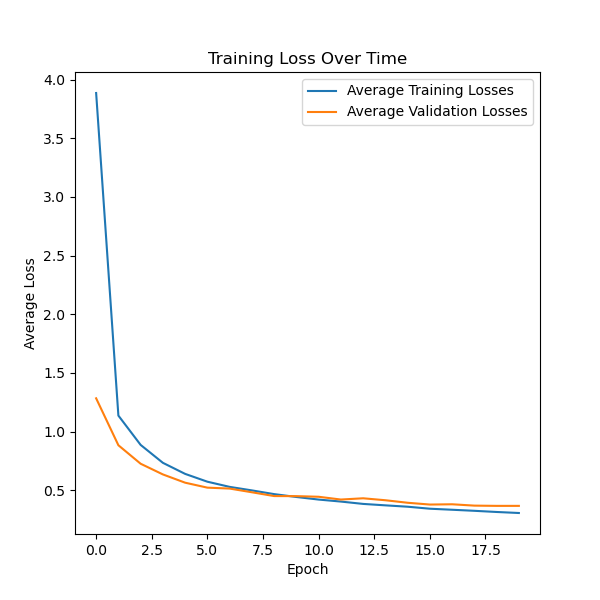
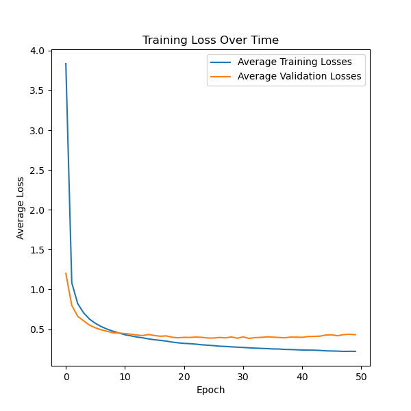

# About
This is a small project which aims to create a Neural Network from scratch, without using any external libraries except for [numpy](https://numpy.org/). The project is written in Python and uses the MNIST dataset to train the Neural Network. The Neural Network is trained using the backpropagation algorithm and Adam optimizer. I drew inspiration from how [PyTorch](https://pytorch.org/) models the different classes, functions and components.

## Results
1. The best model with 20 epochs achieved 93.09% accuracy.

2. The best model with 50 epochs achieved 94.6% accuracy.

## Problems
There's a slight, known, issue with overfitting. This can probably be solved by using Weight Decay, Dropout, or other regularization techniques. However, I am still satisfied with the results and decided to leave it as it is.